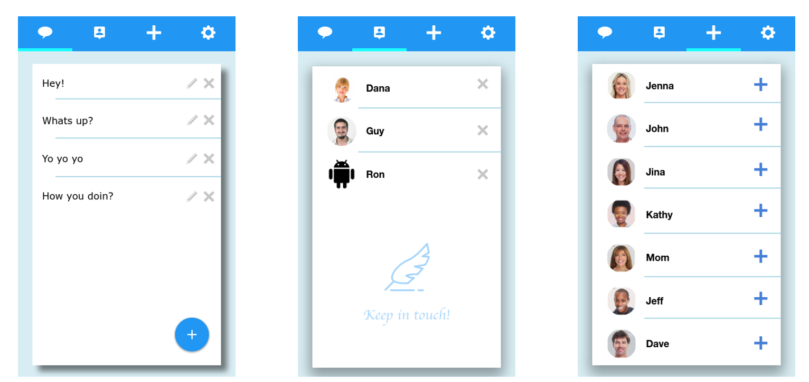
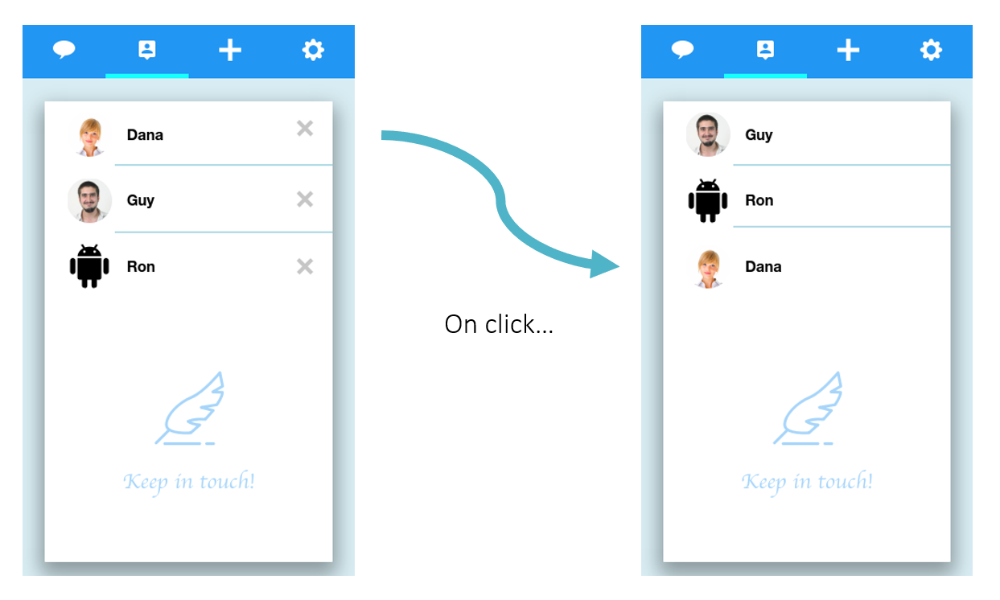

<h1>"Circles" - Android app - HS Java course capstone project</h1>

<h2>The idea behind the app</h2>
Circles is a simple app that helps you keep in touch with the people you care about.
The app is very simple and has three main screens:

1. The **Messages** screen (on the left). On this screen you can add some conversation starters of your choice.
2. The **Circles** screen (in the middle). This is the main screen, where you can see a list of people with whom you want to connect.
3. The **Contacts** screen (on the right). On this screen you can choose to add someone to your Circles, and then he / she will appear on the main screen.

The idea is very simple:
The main list is ordered chronologically so that the person you haven’t texted to the longest is at the top of the list, and the person you texted last is at the bottom.
When I click on a contact, two things will happen:
1. A random message from the bank I defined earlier will be sent to his / her phone (Via your favorite chat app).
2. That contact will move to the bottom of my list.

This way, no more will my contacts be forgotten at the bottom of my chat list.

<h2>Code design</h2>
At first I will not implement my own chat server, but this can be done in future steps (see also future steps in this document).
In order to ship a minimaly functioning app, I will need these objects:

* **Contact**.  
This object has the following properties:
  * name (String)
  * phone number (String)
  * photo (BLOB)

* **MessagesBank**.  
This object is basically a set to which the user can add or remove items.
  * messages (String[])
  * addMessage(String msg)
  * removeMessage(String msg)
  
* **Main**.  
This is the main class, which implements the app idea. This class will have to implement Iterable, and it's iteration will be different (circular).
  * contacts (List<Contact>)
  * chatAppApi (WhatsappAPI wapi) - This will be an instance of the WhatsappAPI class which allows to Interface with Whatsapp.
  * onClick(Integer index) - This method will handle clicks on a contact.
  * onLongClick(Integer index) - This method will remove a contact.
  
* **ChatAppAPI**.  
This is the class that will take care of communicating with the chat app, starting with WhatsApp.
  * sendMessage(String number, String msg)
  * connectToApp - A method that will probably be required.
  * \[Other methods go here\]...

<h2>Remaining issues</h2>
1. Full control over the lists, edit name, change place, deletion alerts, etc...

<h2>In the future</h2>
So, the first two things that this project should develop into are:
1. Allowing multiple instances of the Circle class. This way I can have my personal circle and my business circle for example.
2. Abstrat "Chat API" object that can be a parent to WhatsappAPI, TelegramAPI, SMSAPI etc...

Next there is the more challenging problem of actually making a chat server and implementing the complete chat service.
